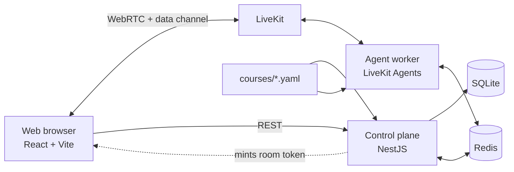

# Rehearsal

Rehearsal is a real-time voice AI English tutor for learners who understand English but hesitate in real conversations. The learner chooses a practical scene, speaks with an AI character through LiveKit, and receives quiet written coaching from a separate coach while the conversation continues.

## Checking out the repository

The walkthrough video `demo.mp4` (~118 MB) is stored with **Git LFS**, so `git-lfs` must be available before that file can be fetched. Set it up once per machine, before cloning:

```sh
# Install git-lfs: brew install git-lfs | apt-get install git-lfs | choco install git-lfs
git lfs install
git clone https://github.com/stkevintan/speak-demo.git
```

## Get Started (Docker)
Create the environment file and start the stack:

```sh
cp .env.example .env
# Edit .env with LiveKit credentials and model configuration.
docker compose up --build -d
```

Open `http://localhost:5173`.


## Features

- One-question onboarding for the learner's English level: A2, B1, or B2
- Six scenario-based conversation courses, including refunds, interviews, parties, salary negotiation, and clinic visits
- Free-form roleplay with a LiveKit voice agent
- Live feedback cards with corrected English and optional Chinese explanations
- Optional response suggestions when the learner pauses
- Typed input fallback when a microphone is unavailable
- End-of-session debrief with goal outcome, corrections, and next-practice recommendation
- Redis-backed live session state and recovery
- SQLite-backed profiles, courses, debriefs, and learning patterns

## Architecture

The repository is a pnpm workspace with three deployable modules and one shared contracts package:



- **Web** owns the UI, ephemeral live-session state, audio controls, and generated API hooks. It never receives provider secrets.
- **Control plane** owns authentication, profiles, course catalog, session setup, LiveKit token minting, durable close/finalization, debriefs, and memory.
- **Agent worker** owns the real-time voice path: turn detection, speech recognition, character generation, text-to-speech, and asynchronous coaching. Interruption hooks exist but are not yet a reliable end-to-end capability.
- **Contracts** contains the shared schemas and protocol types. Modules communicate through contracts rather than importing one another's implementation details.
- **Redis** stores live checkpoints, leases, event replay data, and close handshakes. **SQLite** stores durable application data.

The character and coach are intentionally separate. The character receives the conversation context and speaks in role; the coach receives transcript deltas and publishes written cards. Coach findings are never passed back to the character, so feedback cannot interrupt or change the roleplay. Reliable learner barge-in is not yet available in the current implementation; the UI and protocol contain preliminary interruption paths, but they are not presented as a working feature.

## Key design decisions and tradeoffs

### Cascade voice pipeline instead of speech-to-speech

The MVP uses streamed speech recognition, an LLM, and text-to-speech. This makes transcripts, corrections, replay, and debriefs straightforward and keeps the coach independent from the character. The tradeoff is that transcript-based coaching cannot detect pronunciation or intonation errors; audio-level pronunciation scoring can be added later in the worker.

### Redis for live state, SQLite for durable state

Redis is a good fit for short-lived checkpoints, leases, event streams, and atomic first-wins close commands. SQLite keeps the take-home project easy to run and provides durable local storage without introducing another database server. SQLite is a deliberate MVP constraint: a multi-host deployment would replace the repository implementations with Postgres while retaining the same storage interfaces.

### A stateless control plane

The control plane does not keep session state in process memory. Session recovery can therefore continue after an API restart, and multiple API instances can share the same Redis and durable database. The tradeoff is additional coordination and explicit fencing with worker IDs and epochs.

### Learner-aware turn detection

The worker uses a longer, configurable silence patience than a typical voice assistant and supports an explicit mid-turn commit action. This adds latency, but it avoids cutting off learners while they search for vocabulary or grammar. 

### Content as validated YAML

Courses are documents rather than code. A closed JSON Schema rejects unknown fields before a course reaches the agent, making course authoring easier to review and preventing scenario files from encoding a fixed conversation trajectory.

### Written coaching instead of spoken correction

Corrections appear in a side rail and never interrupt the character. This protects conversational confidence and keeps the interaction useful for learners who need to keep talking. The tradeoff is that learners must look at the UI to receive feedback.

## Getting started locally

Requirements:

- Node.js 20 or newer
- pnpm
- Redis
- A LiveKit Cloud project or compatible LiveKit server with an agent dispatch configured

Install dependencies and create the environment file:

```sh
pnpm install
cp .env.example .env
```

Edit `.env` with your LiveKit credentials, Redis URL, JWT secret, and enabled STT, LLM, coach, and TTS model identifiers. Never commit `.env` or provider credentials.

Build the shared contracts package, then start Redis and the three development processes in separate terminals:

```sh
pnpm --filter @rehearsal/contracts build
pnpm --filter @rehearsal/control-plane dev
pnpm --filter @rehearsal/agent-worker dev
pnpm --filter @rehearsal/web dev
```

Open `http://127.0.0.1:5173`. The control plane serves the API on `http://127.0.0.1:3000` by default.

The browser requires `localhost` or HTTPS for microphone access. If the browser blocks autoplay, use the visible audio-enable control in the interface.


## Validation

Run the focused checks for each module:

```sh
pnpm typecheck
pnpm test
pnpm build
```

Additional contract checks are available through:

```sh
pnpm check
```

The automated tests use fake LiveKit/provider boundaries where appropriate. They validate protocol handling, replay and snapshots, session lifecycle, Redis adapter behavior, turn detection, coaching policies, TTS fallback, and UI state management. They do not replace a live provider acceptance test with a real microphone, LiveKit server, or model account.

## Scaling to 10,000 concurrent sessions

The first step would be to keep the module boundaries and move durable storage from SQLite to a managed Postgres-compatible database. The control plane would run multiple stateless replicas behind a load balancer, with indexed session/recovery queries and a dedicated recovery worker rather than relying only on request processes.

Agent workers would run as a horizontally scaled pool with explicit capacity and admission limits. LiveKit would handle media distribution, while Redis would be deployed as a highly available cluster with carefully chosen key hash slots and bounded event retention. Provider calls would need rate limits, per-provider circuit breakers, backpressure, and quota-aware scheduling. Debrief generation and memory updates could move to an asynchronous queue once the API contract exposes a clear pending state.

Observability would also become mandatory: metrics for active sessions, turn latency, interruption success rate, Redis lease failures, provider errors, queue depth, and debrief completion time, plus trace correlation by session ID.

## Repository layout

```text
apps/web/                    React/Vite frontend
apps/control-plane/          NestJS REST API and durable session lifecycle
apps/agent-worker/           LiveKit voice and coaching worker
packages/contracts/          Shared schemas, protocol, and course loader
courses/                     Validated YAML conversation scenarios
docs/                        Product, architecture, and implementation docs
PROMPT.md                    Take-home project requirements
workflow.md                  Development and AI-assisted workflow
```

## Submission notes

The repository includes the required `PROMPT.md`, `workflow.md`, `.env.example`, source code, and documentation. The interface and agent walkthrough video is committed as `demo.mp4` and stored with Git LFS, so fetch it with `git lfs pull` if it is not already present — see [Checking out the repository](#checking-out-the-repository).
