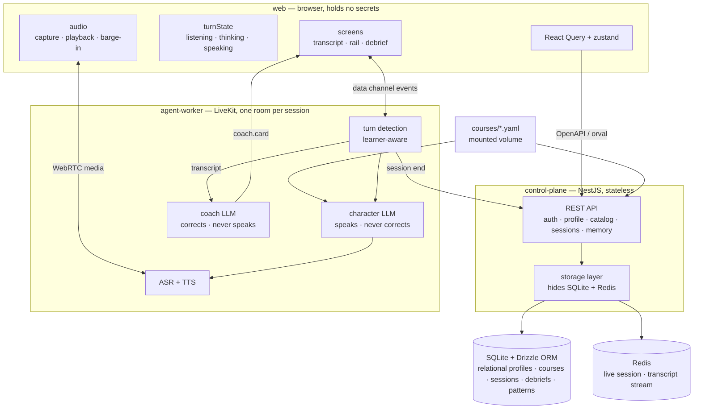

# Rehearsal — Architecture

Modules, functions, and contracts for the MVP in [`PRODUCT.md`](PRODUCT.md),
built to the stack rules in [`CODE_INSTRUCTION.md`](CODE_INSTRUCTION.md). The UI
it produces is in [`design/`](design).

> **Relationship to `design/`.** `design/DESIGN.md` covers the logical shape and
> the UI; this document is the implementation contract and wins on mechanism.

---

## 1. Scope and stack

A real-time voice tutor: the learner talks to a character played by an LLM, and a
second LLM reads the transcript and publishes written corrections the character
never sees.

| Concern | Choice | Why |
|---|---|---|
| Repo | pnpm workspace monorepo, Node + TypeScript | Three deployables share one set of types |
| `web` | React + Vite + Tailwind + orval/React Query + zustand + lucide | `CODE_INSTRUCTION.md` §Web |
| `control-plane` | NestJS + Drizzle ORM + SQLite + Redis | `CODE_INSTRUCTION.md` §API |
| `agent-worker` | LiveKit Agents (Node) | `PROMPT.md` requires LiveKit |
| Contracts | OpenAPI → orval; JSON Schema + zod | `CODE_INSTRUCTION.md` §Contract first |

**Cascade, not speech-to-speech.** The Speak guidance takes speech-to-speech only
when a feature needs audio properties the transcript doesn't carry, and names
pronunciation as the case where cascade fails — ASR normalises a mispronounced
word into the correct text. Pronunciation scoring is buildable, but it is out of
scope here (`PRODUCT.md` cuts pronunciation notes) and the coach needs a
transcript to correct. Known cost: *"I want to buy a ticket"* said with the wrong
stress gets grammar feedback and nothing about the speech. Adding it later means
either moving the character to speech-to-speech or scoring audio out-of-band in
`agent-worker` — the §2 boundary already permits the second without touching
`web` or `control-plane`.

---

## 2. Module map

Three modules, and the seams between them are the design.



**The load-bearing seam is between `character` and `coach`.** They share a
transcript and nothing else. The character is never handed the coach's findings,
so "never lectured mid-scene" is a property of the wiring rather than an
instruction a model might ignore. Corrections have exactly one channel
(`coach.card`) and one producer (the coach), and no other module can emit one.

---

## 3. Monorepo layout

```
rehearsal/
├── pnpm-workspace.yaml
├── tsconfig.base.json
├── Dockerfile                  # multi-stage API and worker images
├── docker-compose.yml          # web, API, worker, and Redis services
├── .env.example
├── courses/                    # mounted as a volume
│   ├── refund.yaml
│   └── raise.yaml
├── apps/
│   ├── web/                    # React + Vite + Tailwind
│   ├── control-plane/          # NestJS
│   └── agent-worker/           # LiveKit Agents
├── packages/
│   └── contracts/              # the only thing all three import
│       ├── openapi.yaml        # hand-written, the source of truth
│       ├── schema/             # JSON Schema: Course, realtime events
│       ├── src/load.ts         # loadCourse() — YAML → Course
│       ├── src/zod/            # runtime validators
│       └── src/generated/      # orval output — committed, never hand-edited
└── docs/
```

`packages/contracts` is the only cross-module dependency. `web` and
`agent-worker` never import from `control-plane`, and `control-plane` never
imports from them. Anything two modules must agree on lives in `contracts`.

---

## 4. Modules

### 4.1 `web`

Owns everything the learner sees and hears. **Holds no provider keys** — the
LiveKit token is minted by `control-plane` and scoped to one room.

| Unit | Responsibility | Deliberately does not |
|---|---|---|
| `screens` | Onboarding, scene picker, live scene, debrief | Decide anything |
| `turnState` | The single owner of `listening / thinking / speaking` | Render |
| `audio` | Capture, playback queue, expose a hard `cancel()` | Decide when to cancel |
| `api` | orval-generated React Query hooks | Contain hand-written fetch logic |
| `store` | zustand: transcript, rail, toggles, connection | Duplicate server state |

**Why `turnState` is its own unit.** Every visible signal — chip colour, label,
waveform, Pip's face, whether the mic is armed — is a pure function of one enum.
`PRODUCT.md`'s "never ambiguous silence" breaks the moment that state is
scattered across components and one branch forgets to update.

**Why zustand *and* React Query.** React Query owns server state (profile,
courses, debrief). zustand owns live session state (transcript, cards, turn
state) which arrives over the data channel and has no request/response shape.

### 4.2 `control-plane`

Stateless NestJS. Every request carries a JWT; nothing session-scoped is kept in
process memory.

| Unit | Responsibility |
|---|---|
| `AuthModule` | Issue/verify JWT, resolve `userId` |
| `ProfileModule` | Level, Chinese toggle, Suggestions toggle |
| `CourseModule` | Serve courses; reject invalid ones at load |
| `SessionModule` | Mint LiveKit tokens, register sessions, produce debriefs |
| `MemoryModule` | Recall patterns in, record patterns out |
| `StorageModule` | The only code that knows SQLite or Redis exist |

**`StorageModule` is the seam that matters.** Repositories are interfaces
(`ProfileRepo`, `SessionRepo`, `PatternRepo`, `CourseRepo`) with a Drizzle ORM
SQLite implementation behind them. The v2 database is fully relational: nested
course, session, debrief, and memory data lives in typed child tables rather than
JSON columns. Redis is reached only through a `LiveSessionStore`. No feature
module imports a driver directly, which is what makes §9 a configuration change
rather than a rewrite.

### 4.3 `agent-worker`

One worker process joins one LiveKit room per session. It runs the whole live
loop: ASR in, character LLM, TTS out, and the coach in parallel.

| Unit | Responsibility |
|---|---|
| `TurnDetector` | Decide when the learner has actually finished — see below |
| `CharacterAgent` | The person you talk to. Never corrects, never breaks character |
| `CoachAgent` | Watches a copy of the transcript. Never speaks |
| `VoicePipeline` | ASR and TTS, streamed |
| `Events` | Publish `state`, `transcript.final`, `coach.card`, `suggestions` |

**Turn detection is the part that is not off-the-shelf.** Standard ASR turn
detection treats a 300–500 ms pause as end-of-utterance, which is wrong for
learners who pause to find a word or conjugate a verb. Policy:

- **A longer silence threshold** (~1200–2000 ms, configurable) before the turn
  commits, instead of the 300–500 ms default.
- **An explicit commit affordance** so a learner who has finished can skip the
  wait. It must never appear before the learner's first utterance: `PRODUCT.md`
  bans "press record" because *connecting is starting*, and the same control on
  the idle screen is exactly that button. Mid-turn it is a way to **finish**,
  never a way to start.
- **Interruption is a target behavior, not a completed capability.** The current
  implementation has interruption hooks, but learner speech during TTS does not
  reliably cancel playback end to end. Once completed, the character's already-
  spoken text must remain in the transcript while only unplayed output is removed.
- **The latency cost is deliberate.** Being cut off mid-thought is the failure
  `PRODUCT.md` cares most about, and the learner can always commit manually.

**The coach runs off the critical path.** It consumes transcript deltas and
publishes cards asynchronously, so nothing about the character's reply waits on
it — a slow coach degrades feedback, not the conversation.

### 4.4 `courses/`

Course content is **documents, not code** (`CODE_INSTRUCTION.md` §Courses), and
the document format is **YAML**. They live in `courses/`, which `docker-compose`
mounts as a volume, so content can change without rebuilding an image.

A course is almost entirely structure — a level list, a budget, an avatar, three
stakes fields, a counterpart, a hint list. Only the two prompts are prose, and
YAML block scalars (`|`) hold those, so they stay readable and diffable. The file
is data end to end, so no parsing layer has to recover structure that is already
there.

**The schema is closed, and that is the anti-trajectory guarantee.** `Course` is
a `strictObject` at every level, so an unknown key is an error rather than an
ignored line. There is no `expectedResponses`, no `turns`, no `successScript` — a
course cannot express a trajectory because there is nowhere to put one. `Goal` is
a win *condition* the learner sees, not a path we walk them down.

Each file opens with a `yaml-language-server` hint pointing at
`schema/course.schema.json`, so an author's editor reports the same rejection the
loader would, while they type.

**`levels` orders, it does not hide.** Every course is offered to every learner;
`levels` only sorts the picker and drives the suitability badge. Hiding a course
risks a dead end if the filter is wrong, and a one-tap level answer is a worse
estimate of what someone can handle than their own judgement.

---

## 5. Function contracts

TypeScript-flavoured signatures for the logic that carries product rules.

### 5.1 The turn state machine

The heart of "never ambiguous silence". One enum, one owner, pure transitions.

```ts
type State = "idle" | "listening" | "thinking" | "speaking" | "ended";

type Event =
  | { t: "connect" }
  | { t: "speech_onset" }
  | { t: "speech_end"; text: string }
  | { t: "commit" }               // learner says "I'm done"
  | { t: "reply_ready" }
  | { t: "tts_end" }
  | { t: "barge_in" }
  | { t: "silence"; ms: number }
  | { t: "end"; reason: "user" | "quit" | "network" }
  | { t: "converge" };             // budget reached — see §5.7

function transition(s: State, e: Event): { next: State; fx: Effect[] };
```

| from | event | to | effects |
|---|---|---|---|
| `idle` | `connect` | `speaking` | character emits its opening line |
| `speaking` | `barge_in` | `listening` | `audio.cancel()`; **keep** spoken text in transcript |
| `speaking` | `tts_end` | `listening` | arm the mic |
| `listening` | `speech_end` | `thinking` | dispatch to character **and** coach; attach `Directive` if converging |
| `listening` | `commit` | `thinking` | commit early, skip the silence wait |
| `listening` | `silence` ≥ 4000 | `listening` | `suggestions.open()` |
| `thinking` | `reply_ready` | `speaking` | start TTS streaming |
| `speaking` | `converge` | `speaking` | character closes in character within two turns |
| `any` | `end` | `ended` | emit debrief — **always**, for any reason |
| `any` | mic failure | *(unchanged)* | plain-language alert, offer typing |

Two rules with teeth: barge-in must **not** discard the transcript, and `end` is
reachable from **every** state, so a learner who closes the laptop mid-word
still gets a debrief.

### 5.2 Session lifecycle

```ts
function createSession(course: Course, profile: Profile, recalled: Pattern[]): Session

interface Session {
  transcript: Turn[];                     // canonical, append-only
  state: State;
  open(): void;                           // → character.openingLine()
  onLearnerUtterance(text: string, timing: Timing): void;
  end(reason: EndReason): Promise<Debrief>; // idempotent and total
}
```

`end()` returns a `Debrief` even when the transcript is one line or empty.
"Never punishing to quit" is enforced here, not in the UI.

### 5.3 Character — speaks, never corrects

```ts
function openingLine(course: Course, recalled: Pattern[]): Promise<string>
function reply(ctx: ConversationCtx, utterance: string, d?: Directive): AsyncIterable<Chunk>
```

- Always returns a line — the learner is never shown a blank page.
- The opening is answerable in three words: *"Hi there, how can I help you today?"*
- Streams, so the first word plays before the sentence ends.
- Calibrated to `profile.level`: A2 short sentences and common words, B2 natural
  speed and idiom.
- Firm but never hostile — always leaves a way forward.
- Never corrects, enforced by wiring and not just by the prompt: the character is
  never given the coach's findings, so it has nothing to leak.
- Returns `{ goalMet: boolean }` with each reply — the only component that knows
  whether it conceded, which is what makes `won` deterministic (§5.6).
- Honours a `Directive` by converging on a close instead of opening a new thread
  (§5.7).

### 5.4 Coach — corrects, never speaks

```ts
function observe(utterance: string, ctx: CoachCtx): Promise<Finding[]>
function admit(f: Finding, history: History): boolean
function explain(f: Finding): { en: string; zh: string }
```

`observe` returns **both** problems and things done well. Positive findings use
the same machinery as mistakes, because "positive cards always show" cannot
depend on happening to find nothing wrong.

```ts
const NIT_COOLDOWN_TURNS = 2;   // one nit per two turns — see PRODUCT.md "Never flooded"

function admit(f: Finding, h: History): boolean {
  if (f.kind === "nice") return true;              // positives always show
  if (h.seen(f.category, f.quote)) return false;   // never the same correction twice
  if (h.nitsSince(NIT_COOLDOWN_TURNS) > 0) return false;
  return true;
}
```

Everything `PRODUCT.md` says about not flooding the learner collapses into those
four lines. If this function is wrong, the product is wrong.

`explain` produces the English and Chinese lines **together**. There is no code
path that returns English alone, because a correction the learner can't parse
teaches nothing.

**The positive rate.** The coach also reports one scalar over its **raw**
`observe()` findings — `nice` ÷ total — as `CoachSignal`. It is computed
*before* `admit()`, and that ordering is the point: the admitted set is filtered
for the learner's benefit (nits on a cooldown, duplicates dropped), so a rate
taken over it would measure the filter rather than the learner. Raw findings are
a per-utterance assessment, which is a fair sample.

Two hard rules attach to it: it is **never shown as a number** (a percentage of
correctness is the overall score `PRODUCT.md` bans), and it **never decides
`won`** — see §5.6.

### 5.5 Memory

```ts
function recall(userId: string): Promise<Pattern[]>    // before openingLine
function record(session: Session): Promise<void>       // at end()
```

`record` counts slips **by category across sessions**, not by sentence — the
next session needs *"past tense, three times"*, not yesterday's transcript. Both
are best-effort: a memory failure degrades the callback, never the session.

### 5.6 Debrief

```ts
function buildDebrief(s: Session, course: Course, signal: CoachSignal): Debrief

type Debrief = {
  won: boolean;                   // goal-based — see below
  headline: string;
  worked: string[];               // always populated
  watch: string[];                // repeated patterns, with counts
  corrections: Correction[];      // every sentence, fixed
  next: CourseRef;
};
```

`buildDebrief` runs in `control-plane`, from the session state the worker leaves
in Redis — transcript, findings, `goalMet` — so a dropped connection still
produces a debrief (§8).

**`won` answers the scene's question, not the English question.** It comes from
the character's `goalMet` flag, never from the coach's positive rate. The two
come apart, and the direction they come apart in decides the design:

- Gets the refund, three grammar errors → *won the scene*, messy English.
- Speaks beautifully, never gets the refund → *did not win the scene*.

Deriving `won` from the positive rate would tell that second learner they won a
task they never did — worse than telling the first their English was messy. And
a proficiency percentage gating a task verdict is the overall score `PRODUCT.md`
bans, wearing a different hat. Hence `won: boolean`: "did you win?" is a game
question, and games are binary. `worked[]` is what cushions a "no", not a third
verdict.

**The positive rate earns its place elsewhere:** it orders `worked[]` so the most
genuine praise leads, picks the `headline`, and chooses `next` — a learner whose
rate is low on articles gets routed to a course that exercises them. Routing and
encouragement, never a verdict, never a number on screen.

**`worked[]` has a deterministic floor.** If the coach yields nothing — provider
hiccup, or a two-turn session — it falls back to facts we know without it: turns
taken, no switch to Chinese, no abandonment. Without this, §8's rule that a coach
failure leaves the scene unaffected would silently empty a field this section
promises is never empty.

---

### 5.7 Ending the session

A scene with no exit is a scene the learner abandons, and `PRODUCT.md` says
quitting must never be punished. So the end is designed from both directions.

**The character converges on its own.** A scene has a soft budget: a learner-turn
count and a goal-satisfied signal. When either trips, the character is handed a
directive alongside its normal prompt:

```ts
type Directive = { converge: true; withinTurns: 2 };

function shouldConverge(s: Session, course: Course): boolean {
  return s.goalSatisfied || s.learnerTurns >= (course.budget?.learnerTurns ?? 12);
}
```

The character then closes the interaction **in character** — *"Great, I've
refunded it to your card. Anything else?"* — and stops opening new threads. No
system message, no timer, no countdown: the learner experiences a conversation
that arrived at its natural end, because that is what it is.

**The learner can leave at any point.** The end affordance is visible for the
whole session and takes one tap. It does not confirm or warn.

**Every path converges on the same code.** By goal, by budget, by the learner, or
by a dropped connection — every exit goes through `Session.end(reason)` and
produces a `Debrief`. The reason is recorded but never surfaced as a judgement:
someone who left after two turns gets the same structure as someone who
finished, filled in with whatever actually happened.

**Deliberately not done:** a hard timer, or a character that refuses to keep
talking. Both punish the learner for being engaged, which is the opposite of the
point.

## 6. Contracts

### 6.1 Contract first

Per `CODE_INSTRUCTION.md`: the OpenAPI document is written **before** the
implementation, orval generates the client from it, and zod validates at
runtime. Three enforcement points, so a contract can't quietly rot:

| Layer | Artifact | Checked |
|---|---|---|
| HTTP | `packages/contracts/openapi.yaml` | orval at build; zod in the NestJS pipe |
| Course docs | `courses/*.yaml` → `Course` | `pnpm check:courses` (offline) **and** zod at load |
| Realtime | `packages/contracts/schema/events/*.json` | zod on both ends of the data channel |

`schema/` is **generated from the zod schemas**, not written alongside them, so
the JSON Schema and the runtime validator cannot disagree. `pnpm check:schema`
fails on drift, which is what makes "generated" a guarantee rather than a
convention. `openapi.yaml` `$ref`s those files instead of restating them, so the
spec is a third view of one shape rather than a third copy of it.

### 6.2 HTTP surface (OpenAPI)

| Method | Path | Returns |
|---|---|---|
| `GET` | `/api/me` | `Profile` — level, toggles, patterns |
| `PATCH` | `/api/me` | `Profile` |
| `GET` | `/api/courses` | `CourseCard[]` — every course, sorted by level fit, never filtered |
| `GET` | `/api/courses/{id}` | `Course` |
| `POST` | `/api/sessions` | `{ sessionId, livekit: { url, token }, recalled }` |
| `POST` | `/api/sessions/{id}/end` | `Debrief` |
| `GET` | `/api/sessions/{id}/debrief` | `Debrief` |

The LiveKit token is minted here and scoped to one room. It is the only
credential the browser ever holds — provider keys stay in `agent-worker` and
`control-plane`.

### 6.3 Realtime surface (LiveKit data channel)

Validated with zod on both ends; the schemas are shared from
`packages/contracts`.

| Event | Direction | Payload |
|---|---|---|
| `agent.state` | worker → web | `{ state: State }` — the worker emits the three live values; `idle` and `ended` are the browser's own |
| `transcript.final` | worker → web | `{ role: "learner" \| "character", text, tStart, tEnd }` |
| `coach.card` | worker → web | `{ kind, category, quote, better?, en, zh }` |
| `suggestions` | worker → web | `{ prompt, options: string[] }` |
| `alert` | worker → web | `{ code: "mic_unavailable", message }` |
| `session.end` | web → worker | `{ reason: "user" }` |

`coach.card` is deliberately the only channel carrying corrections. Nothing else
in the system can produce one, which is why the character can't lecture even by
accident.

### 6.4 Course document

A course is a YAML document. Every key maps to a field of `Course`; the two
prompts use block scalars so multi-paragraph prose stays readable.

```yaml
# yaml-language-server: $schema=../packages/contracts/schema/course.schema.json
id: refund
version: 1
title: Returning a faulty item
levels: [B1]                 # orders and badges only — see §4.4
accent: violet               # a palette name, never a hex — see below
budget:
  learnerTurns: 12           # soft ceiling, max 20 — see §5.7, §11
avatar:
  style: bob
  mood: stern
  hair: "#3D3659"            # quoted — a bare # starts a YAML comment
  skin: "#FFD3B0"
stakes:
  you: a customer with a broken item and no receipt
  setting: A busy electronics store, Saturday afternoon
  edge: would rather you went away
goal: Get a refund without escalating.
counterpart:
  name: Dana
  role: store clerk
  goal: Follow policy. Be polite, but do not concede easily.
opener: Hi there — how can I help you today?
coachHints:
  - articles
  - past-tense narration
prompts:
  character: |
    You are Dana, a store clerk. Stay in character. Never correct the learner...
  coach: |
    Watch for article errors and tense shifts. Return findings as JSON...
```

A missing key, an unknown key, or malformed YAML is an error naming the file
(§8), because the closed schema is what makes "do not fix the trajectory"
checkable rather than aspirational.

**`accent` is a palette name, not a colour.** `UI.md` §3 fixes the six hues and
their ink tones, and §6 records the contrast rule those pairs satisfy. Letting a
course file write a hex would let a content edit break an accessibility
guarantee that was verified once and is now nobody's job to re-verify. The
tokens themselves live in `web`; a course picks a name from a closed enum.

**The object is the contract, not the file.** There is one JSON Schema, generated
from the zod `Course` schema, and `openapi.yaml` `$ref`s it — so the format needs
no second description of itself, and no JSON Schema ever has to understand YAML.
`loadCourse(text: string, source?: string): Course` lives in
`packages/contracts`: `yaml` parses, zod validates, and the error names the file.
`control-plane` and `agent-worker` load identically and cannot drift, and
`pnpm check:courses` runs the same function over every file in `courses/`.

`coachHints` and `prompts` are **hints, not a script**. `agent-worker` reads
`prompts`, `coachHints` and `opener`; `web` reads `title`, `levels`, `accent`,
`avatar`, `stakes`, `goal` and `counterpart`, which is exactly what `CourseCard`
carries (§6.2).

---

## 7. Data that crosses a boundary

§6.3 lists the wire events. This is what actually moves, and where it stops.

| Payload | Path | Contains |
|---|---|---|
| Media | web ↔ worker, via LiveKit | Audio. Never transits `control-plane` |
| Transcript | worker → Redis | Text + timing. Read by the coach, never written to SQLite (§11) |
| Findings | worker → Redis | The `coach.card` payloads, kept for the debrief |
| `goalMet` | worker → Redis | The character's verdict on the scene |
| `Debrief` | control-plane → web | Built at `end()` from the three rows above |
| `Pattern[]` | control-plane → worker | Recalled at session start, in the token response |

`control-plane` mints a token and gets out of the media path entirely, which is
what keeps it stateless and cheap to scale.

---

## 8. Error paths

Every row ends in a next action. No path leaves the learner stuck.

| Failure | Response |
|---|---|
| Mic unavailable or muted | Plain-language alert, "Fix my mic" + "Keep typing"; scene continues |
| Learner silent 4 s | Suggestions open, if the switch is on |
| Learner silent 30 s | Character re-engages **in character** — never a system "are you there?" |
| Scene passes its turn budget | Character converges on a close within two turns — never a system cutoff |
| Learner ends it early | Straight to debrief; the reason is never shown as a judgement |
| TTS fails | The character's text still lands in the transcript |
| Coach LLM fails | The scene is unaffected; fewer cards |
| Network drops mid-scene | Debrief still produced from what's in Redis |
| Memory write fails | Session unaffected; the callback simply doesn't fire next time |
| Course document invalid | Rejected at load, naming the file and the offending key or path; the picker omits it |

---

## 9. Scaling to 10,000 concurrent sessions

`PROMPT.md` asks for this explicitly. In rough order of when each thing breaks:

1. **SQLite is the first wall** — single-writer. Move the Drizzle-backed
   repository to Postgres behind the same `StorageModule` interfaces (this is why
   the storage layer exists). Sessions are already keyed by id, so nothing above
   the repository changes.
2. **`control-plane` scales out as-is.** Stateless and JWT-authenticated, so it
   goes behind a load balancer with no sticky sessions; Redis becomes Redis
   Cluster.
3. **The real constraint is model concurrency, not our compute.** 10k sessions
   means ~10k concurrent ASR, LLM and TTS streams — a rate-limit and cost problem
   needing admission control, per-user quotas, and a queue in front of session
   start. Provider throughput is the bottleneck, not our CPU.
4. **`agent-worker` scales by replica.** LiveKit dispatches rooms across a worker
   pool. At 10k rooms, pin heavy sessions to dedicated pools rather than packing
   rooms per process.
5. **Move the coach to its own pool.** It already runs off the critical path, so
   it becomes a separate consumer group over a Redis stream, scaling
   independently of conversation latency.
6. **Make the debrief a queued job.** Today `end()` builds it inline; at scale,
   enqueue it and let the learner receive it over the data channel.

The load-bearing decision for all of this is that the coach is asynchronous and
`control-plane` is stateless. Those two choices are what make the rest a
deployment change rather than a redesign.

---

## 10. Packaging and build notes

`CODE_INSTRUCTION.md` says local-dev first, docker at the end, with the container
in mind throughout. What that constrains:

| Rule | Detail |
|---|---|
| Never hardcode `process.cwd()` | Resolve from `COURSES_DIR` / `DATA_DIR`, defaulting relative to the module's own directory (`import.meta.url`). In a container the cwd is not the repo root, and a cwd-relative path is the classic way a working local build becomes a broken image |
| Static assets | Built to `apps/web/dist`, served by nginx, content-hashed filenames. The dev server never assumes it serves from the repo root |
| Playwright | Renderer only — `design/mockups/build.sh` produces the seven PNG snapshots, which is not test usage. No test suite is added, and `design/` is left as-is |
| Docker | Three Dockerfiles, one `docker-compose.yml` bringing up `web`, `control-plane`, `agent-worker`, `redis`, mounting `courses/` and a named volume for the SQLite file |
| Config | Everything from `.env` at the repo root; `.env.example` lists every variable and the image contains no secrets |

Variables: `LIVEKIT_URL`, `LIVEKIT_API_KEY`, `LIVEKIT_API_SECRET`, the ASR / LLM /
TTS provider keys, `REDIS_URL`, `DATA_DIR`, `COURSES_DIR`, `JWT_SECRET`.

---

## 11. Decisions and open questions

The product calls, and why. These are the tradeoffs the take-home is asking
about, so they are recorded rather than left implicit.

| Decision | Choice | Rationale |
|---|---|---|
| Transcripts persisted? | **No** — findings and the debrief only | `corrections[]` already keeps every sentence that mattered; the rest is the most sensitive data we hold and we never read it again |
| Source of `won` | The character's `goalMet` flag | The scene asks "did you get the refund", not "was your English clean" — see §5.6 |
| Coach positive rate | Drives `worked[]`, `headline` and `next` | Encouragement and routing. Never a verdict, never a number on screen — see §5.4 |
| `budget.learnerTurns` | Rejected above 20, `maximum: 20` | §5.7 is a product guarantee; content that can set 200 can silently break it. Rejected rather than clamped, because silently rewriting 200 to 20 leaves the author believing a number that is not in effect |
| Course `levels` | Ordering and badging only — never hide | Hiding risks a dead end, and a one-tap level answer is a worse estimate than the learner's own |
| Auth | One hardcoded dev user behind the JWT interface | Memory across sessions needs a stable id; real login adds nothing in two hours |
| Pronunciation scoring | Out of scope | Buildable, but the two-hour budget doesn't cover it — upgrade paths in §1 |
| Playwright | Renderer only, no test suite | `CODE_INSTRUCTION.md` bans Playwright tests, not screenshots |

Still open, and an implementation call rather than a product one: whether the
coach runs in `agent-worker` or its own service. Lean is in-worker for the MVP;
§9 step 5 splits it out when coach load needs to scale independently.
