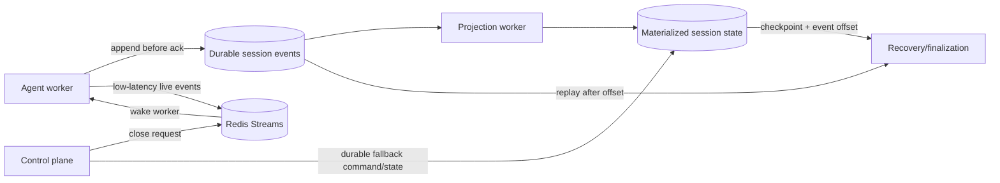

# Session Durability and Recovery Optimization

## Goal

Make live sessions scalable and recoverable while retaining the complete transcript in durable storage. The design separates three concerns:

1. **Append-only events** are the durable source of truth.
2. **Materialized session state** provides a compact, fast recovery snapshot.
3. **Redis Streams** provide low-latency command notification without requiring short polling intervals.

The optimization reduces checkpoint write amplification and close-command latency without weakening worker fencing, replay, or debrief correctness.

## Current bottlenecks

The current worker checkpoint contains the public snapshot and the full transcript. Updating it for every durable event can repeatedly serialize and write an O(transcript-size) payload. The Redis event stream is also bounded for browser replay, so it cannot be the permanent transcript archive.

Close requests are written to a Redis key and discovered by the worker's polling loop. Polling is reliable when combined with the durable key, but close latency is bounded by the polling interval and every active worker performs periodic checks.

## Target architecture



For the existing stack, the durable event store can initially be the SQLite repository behind `StorageModule`. The repository interface should allow a later PostgreSQL or Kafka-backed implementation without changing worker or web contracts.

## 1. Append-only durable events

Every transcript and state-changing event receives a stable `eventId` and a consecutive per-session `seq`. The worker persists the event before treating it as successful or publishing it to the browser.

A durable event includes at least:

- `sessionId`;
- `eventId` and schema version;
- monotonic `seq`;
- event type and validated payload;
- event timestamp;
- worker ID and epoch where ownership matters.

The durable store must enforce `(sessionId, seq)` and `eventId` uniqueness. Retried writes therefore become idempotent. A projection may lag, but it must never advance past an event that is not durably present.

The durable event log is the authoritative transcript. Redis replay data is only a cache for active browser connections and bounded sync.

## 2. Compact checkpoints and materialized state

A checkpoint is a materialized view at a known event sequence, not a second copy of the transcript. It should contain only derived state needed for live UI, recovery, and close finalization:

```ts
interface CompactCheckpoint {
  sessionId: string;
  workerId: string;
  epoch: number;
  lastAppliedSeq: number;
  transcriptCount: number;
  transcriptHash: string;
  snapshot: SessionSnapshot;
  findings: ExplainedFinding[];
  signal: CoachSignal;
  goalMet: boolean;
  learnerTurns: number;
}
```

The complete transcript remains in the durable event table/log. `transcriptCount` and `transcriptHash` provide inexpensive integrity checks without serializing all transcript text into every checkpoint.

Checkpoint updates can be batched or periodic, for example every N durable events or every few seconds. A final checkpoint is mandatory before a successful close acknowledgement. The checkpoint's `lastAppliedSeq` must never exceed the durable event high-watermark.

Recovery is bounded and deterministic:

```text
load checkpoint at sequence N
load durable events N+1 through H
validate consecutive sequences and event IDs
apply events to the materialized state
resume or finalize from the reconstructed state
```

If the durable suffix is unavailable or invalid, recovery must fail conservatively and use the last valid checkpoint for fail-to-debrief handling. It must not fabricate an empty transcript.

## 3. Redis Streams as a low-latency command queue

Use a dedicated Redis Stream for control commands such as `session.close`, while keeping the command record/idempotency state in Redis and the transcript in durable storage.

```text
Control plane:
  SET close-request if absent       # durable first-wins command record
  XADD session:{id}:commands        # wake-up notification

Worker:
  XREADGROUP BLOCK ... commands     # prompt delivery
  read and validate close-request   # source of truth and idempotency
  process close exactly once logically
  XACK only after finalization state is written
```

The Stream is an at-least-once delivery mechanism, not the source of truth. A message can be delivered more than once, lost from an active connection, or remain pending after a worker crash. Therefore:

- the close request key remains the durable idempotency record;
- every command has a stable `commandId`;
- the worker verifies session ID, command ID, reason, lease, and epoch;
- duplicate commands return the existing acknowledgement or no-op;
- pending entries are reclaimed with `XAUTOCLAIM` after a worker failure;
- the heartbeat/poll fallback remains available for missed notifications;
- the stream must not be trimmed before all required consumers acknowledge it.

For close commands, the Stream primarily removes polling latency. It should not replace the Redis lease, fenced checkpoint, close acknowledgement, or durable debrief boundary.

The existing bounded `events` stream remains optimized for browser replay (`MAX_REPLAY_EVENTS`). The command stream should be separate so transcript replay retention and command delivery retention do not interfere with each other.

## Correctness invariants

1. A stale worker cannot append events, update a checkpoint, or freeze a close acknowledgement after a newer epoch owns the session.
2. An event is acknowledged only after durable persistence.
3. A checkpoint records the exact `lastAppliedSeq` of its derived state.
4. Replaying the same event or command is idempotent.
5. `CloseAck.finalSeq` includes the final `session.ended` event.
6. SQLite/debrief persistence completes before live Redis and LiveKit cleanup is considered successful.
7. Redis loss can affect live coordination, but cannot lose an already persisted transcript.

## Recommended implementation phases

The work should be incremental. Each phase must leave the existing product usable and independently testable.

### Phase 0: establish invariants and measurements

1. Record current checkpoint size, checkpoint write latency, event append latency, close-request latency, and recovery duration.
2. Add structured metrics for session ID, event sequence, worker epoch, projection lag, and retry counts. Never log transcript contents.
3. Write contract tests for duplicate event IDs, sequence gaps, stale epochs, duplicate close commands, and close acknowledgement idempotency.
4. Define retention, deletion, encryption, and access-control requirements for transcript data before making it durable.

**Exit condition:** baseline dashboards/tests exist and the current Redis-only behavior is documented.

### Phase 1: create the durable event boundary

1. Add a `SessionEventRepo` port in the control-plane storage layer.
2. Add a durable event table/store with unique `(sessionId, seq)` and `eventId` constraints.
3. Persist transcript events before publishing them to Redis or the browser.
4. Make retries idempotent: an already persisted event returns success without duplicating it.
5. Keep the existing Redis `events` stream as the bounded browser-replay cache.
6. Add restart, duplicate-write, failure-before-publish, and failure-after-persist tests.

**Exit condition:** a Redis restart or worker restart cannot lose an event that was acknowledged as durable.

### Phase 2: introduce the materialized projection

1. Define a projector that consumes durable events in sequence order.
2. Rebuild the current public snapshot, findings, goal state, and counters from events.
3. Add `lastAppliedSeq`, transcript count, and transcript hash to the checkpoint.
4. Compare the projected high-watermark with the durable event high-watermark and expose projection lag.
5. Keep the full transcript out of normal checkpoint writes; retain it only in durable events.
6. Add deterministic replay tests: checkpoint at N plus events N+1..H must equal a fresh projection through H.

**Exit condition:** checkpoint payload size is approximately constant as transcript length grows, and recovery produces the same state as normal processing.

### Phase 3: migrate recovery and close finalization

1. Load the compact checkpoint during recovery.
2. Replay the durable event suffix after `lastAppliedSeq`.
3. Validate consecutive sequences, event IDs, transcript count/hash, and worker epoch.
4. Force a final event append and projection before producing `CloseAck`.
5. Persist the immutable debrief before deleting Redis/LiveKit state.
6. Make cleanup retryable and independent from the durable debrief boundary.
7. Test worker crash, stale-worker writes, missing suffix, corrupt checkpoint, repeated finalization, and cleanup retry.

**Exit condition:** a replacement or recovery path can reconstruct the latest valid conversation without an empty fabricated transcript, and close is idempotent.

### Phase 4: replace close polling with Redis Stream notification

1. Create a separate `session:{id}:commands` Redis Stream and consumer group; do not reuse the browser replay stream.
2. Keep the first-wins `close-request` record as the durable command/idempotency source of truth.
3. When the close request is created, append a `session.close` notification containing the stable `commandId`.
4. Have the worker block on `XREADGROUP` instead of relying on frequent polling.
5. On receipt, reread and validate the close-request record, session ID, reason, lease, and epoch.
6. ACK the stream entry only after the fenced close operation and durable finalization boundary succeed.
7. Use `XAUTOCLAIM` to reclaim pending commands after worker failure.
8. Retain heartbeat/poll fallback for missed notifications and Redis reconnects.
9. Measure command-to-observation latency and redelivery rate.

**Exit condition:** normal close notification latency is below the old polling interval while duplicate delivery and missed notifications remain safe.

### Phase 5: scale the storage implementation

1. Move durable events and materialized views from SQLite to PostgreSQL when single-writer limits are reached.
2. Add indexed queries by `(sessionId, seq)` and tenant/user retention boundaries.
3. Partition or archive old events according to the retention policy.
4. Introduce Kafka only if throughput, retention, independent consumers, or cross-service replay justify operating it.
5. Keep Redis for active-session coordination, leases, fencing, bounded replay, and low-latency command notification.

**Exit condition:** multiple control-plane replicas and worker fleets can reconcile sessions without process-local state or conflicting ownership.

## Measurements

Track these metrics before and after migration:

- checkpoint payload bytes and serialization time;
- durable event append latency;
- projection lag (`event high-watermark - checkpoint seq`);
- recovery replay count and duration;
- close request to worker observation latency;
- command redelivery and pending-entry reclaim counts;
- debrief persistence latency;
- transcript durability failures and retry counts.

Success means checkpoint writes remain approximately constant-size, close notification latency falls below the polling interval, and recovery time remains bounded by checkpoint age rather than total transcript length.

## Coordination service extraction

A coordination service is a useful code boundary even before it becomes a separately deployed service. It encapsulates Redis key naming, Lua scripts, streams, leases, fencing, checkpoints, close acknowledgements, and reconciliation behind semantic session operations.

```text
Control plane ─┐
                ├─ semantic coordination API ─> Redis + durable storage
Agent worker ───┘

Coordination service
  ├─ acquire/renew/release worker lease
  ├─ append durable event and publish live event
  ├─ read/write compact checkpoint
  ├─ request and observe close
  ├─ freeze final record
  ├─ reconcile expired or incomplete sessions
  └─ retry post-finalization cleanup
```

The service can be stateless at the process level: every replica reads authoritative state from Redis and durable storage, and no session truth lives only in memory. Its operations must be idempotent and preserve worker epoch fencing. Reconciliation is one logical role, not necessarily one permanent process.

Use a single logical reconciliation leader initially. A short-lived leader lease gives one replica responsibility for global scans while standby replicas can take over after lease expiry. If the workload later exceeds one loop's capacity, replace the global scan with session claims or deterministic shard ownership. Those claims are coordination primitives, not another service layered above the reconciler.

Prefer this extraction path:

```text
Phase A: CP + worker -> shared coordination module -> Redis
Phase B: CP + worker -> coordination service -> Redis + durable storage
```

Phase A keeps local calls fast and avoids adding a network failure boundary. The semantic ports and tests should be identical in both phases, so Phase B changes deployment rather than domain behavior. Do not put audio, ASR, LLM, or TTS work behind this API; it owns authoritative session mutations and recovery only.

The coordination service is not etcd. It does not provide general-purpose consensus or become the source of all cluster metadata. Redis or the durable database supplies the storage/lease primitive; the coordination layer applies product-specific session semantics. Use a stronger system such as etcd only if broader strongly consistent cluster coordination is required.

## Decision summary

The recommended production shape is:

```text
Durable append-only transcript events
  -> compact materialized session checkpoint
  -> Redis cache for active replay
  -> Redis Stream command queue for fast worker notification
  -> fenced, idempotent close/finalization
```

Redis Streams improve delivery latency, but durable events and compact materialized state provide the scalability and recoverability guarantees. Kafka or another dedicated MQ is an evolution option, not a prerequisite for this architecture.
