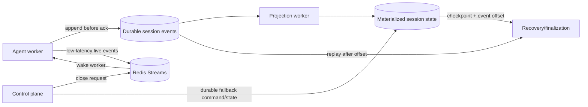

# Session Durability and Recovery Optimization

## Goal

Make live sessions scalable and recoverable while retaining the complete transcript in durable storage. The design separates three concerns:

1. **Append-only events** are the durable source of truth.
2. **Materialized session state** provides a compact, fast recovery snapshot.
3. **Redis Streams** provide low-latency command notification without requiring short polling intervals.

The optimization reduces checkpoint write amplification and close-command latency without weakening worker fencing, replay, or debrief correctness.

## Current bottlenecks

The current worker checkpoint contains the public snapshot and the full transcript. Updating it for every durable event can repeatedly serialize and write an O(transcript-size) payload. The Redis event stream is also bounded for browser replay, so it cannot be the permanent transcript archive.

Close requests are written to a Redis key and discovered by the worker's polling loop. Polling is reliable when combined with the durable key, but close latency is bounded by the polling interval and every active worker performs periodic checks.

## Target architecture



For the existing stack, the durable event store can initially be the SQLite repository behind `StorageModule`. The repository interface should allow a later PostgreSQL or Kafka-backed implementation without changing worker or web contracts.

## 1. Append-only durable events

Every transcript and state-changing event receives a stable `eventId` and a consecutive per-session `seq`. The worker persists the event before treating it as successful or publishing it to the browser.

A durable event includes at least:

- `sessionId`;
- `eventId` and schema version;
- monotonic `seq`;
- event type and validated payload;
- event timestamp;
- worker ID and epoch where ownership matters.

The durable store must enforce `(sessionId, seq)` and `eventId` uniqueness. Retried writes therefore become idempotent. A projection may lag, but it must never advance past an event that is not durably present.

The durable event log is the authoritative transcript. Redis replay data is only a cache for active browser connections and bounded sync.

## 2. Compact checkpoints and materialized state

A checkpoint is a materialized view at a known event sequence, not a second copy of the transcript. It should contain only derived state needed for live UI, recovery, and close finalization:

```ts
interface CompactCheckpoint {
  sessionId: string;
  workerId: string;
  epoch: number;
  lastAppliedSeq: number;
  transcriptCount: number;
  transcriptHash: string;
  snapshot: SessionSnapshot;
  findings: ExplainedFinding[];
  signal: CoachSignal;
  goalMet: boolean;
  learnerTurns: number;
}
```

The complete transcript remains in the durable event table/log. `transcriptCount` and `transcriptHash` provide inexpensive integrity checks without serializing all transcript text into every checkpoint.

Checkpoint updates can be batched or periodic, for example every N durable events or every few seconds. A final checkpoint is mandatory before a successful close acknowledgement. The checkpoint's `lastAppliedSeq` must never exceed the durable event high-watermark.

Recovery is bounded and deterministic:

```text
load checkpoint at sequence N
load durable events N+1 through H
validate consecutive sequences and event IDs
apply events to the materialized state
resume or finalize from the reconstructed state
```

If the durable suffix is unavailable or invalid, recovery must fail conservatively and use the last valid checkpoint for fail-to-debrief handling. It must not fabricate an empty transcript.

## 3. Redis Streams as a low-latency command queue

Use a dedicated Redis Stream for control commands such as `session.close`, while keeping the command record/idempotency state in Redis and the transcript in durable storage.

```text
Control plane:
  SET close-request if absent       # durable first-wins command record
  XADD session:{id}:commands        # wake-up notification

Worker:
  XREADGROUP BLOCK ... commands     # prompt delivery
  read and validate close-request   # source of truth and idempotency
  process close exactly once logically
  XACK only after finalization state is written
```

The Stream is an at-least-once delivery mechanism, not the source of truth. A message can be delivered more than once, lost from an active connection, or remain pending after a worker crash. Therefore:

- the close request key remains the durable idempotency record;
- every command has a stable `commandId`;
- the worker verifies session ID, command ID, reason, lease, and epoch;
- duplicate commands return the existing acknowledgement or no-op;
- pending entries are reclaimed with `XAUTOCLAIM` after a worker failure;
- the heartbeat/poll fallback remains available for missed notifications;
- the stream must not be trimmed before all required consumers acknowledge it.

For close commands, the Stream primarily removes polling latency. It should not replace the Redis lease, fenced checkpoint, close acknowledgement, or durable debrief boundary.

The existing bounded `events` stream remains optimized for browser replay (`MAX_REPLAY_EVENTS`). The command stream should be separate so transcript replay retention and command delivery retention do not interfere with each other.

## Correctness invariants

1. A stale worker cannot append events, update a checkpoint, or freeze a close acknowledgement after a newer epoch owns the session.
2. An event is acknowledged only after durable persistence.
3. A checkpoint records the exact `lastAppliedSeq` of its derived state.
4. Replaying the same event or command is idempotent.
5. `CloseAck.finalSeq` includes the final `session.ended` event.
6. SQLite/debrief persistence completes before live Redis and LiveKit cleanup is considered successful.
7. Redis loss can affect live coordination, but cannot lose an already persisted transcript.

## Recommended implementation phases

### Phase 1: durable transcript boundary

- Add a durable session-event repository behind `StorageModule`.
- Persist transcript events with unique event IDs and `(sessionId, seq)` constraints.
- Keep the current Redis stream for browser replay.
- Add restart and duplicate-write tests.

### Phase 2: compact projection

- Remove the full transcript from hot checkpoint writes.
- Add `lastAppliedSeq`, count, and hash to the checkpoint contract.
- Project durable transcript events into the current session snapshot.
- Force and validate a final projection before close acknowledgement.

### Phase 3: command stream

- Add `session:{id}:commands` with a consumer group.
- Publish a `session.close` notification after the first-wins close-request record succeeds.
- ACK only after the worker has completed the fenced close operation.
- Add pending-entry reclaim and retain the polling fallback.

### Phase 4: scale-out storage

- Move durable session events and materialized views to PostgreSQL when SQLite single-writer limits are reached.
- Consider Kafka only when event throughput, retention, independent consumers, or cross-service replay justify its operational cost.
- Keep Redis for active-session coordination, leases, fencing, and low-latency notifications.

## Measurements

Track these metrics before and after migration:

- checkpoint payload bytes and serialization time;
- durable event append latency;
- projection lag (`event high-watermark - checkpoint seq`);
- recovery replay count and duration;
- close request to worker observation latency;
- command redelivery and pending-entry reclaim counts;
- debrief persistence latency;
- transcript durability failures and retry counts.

Success means checkpoint writes remain approximately constant-size, close notification latency falls below the polling interval, and recovery time remains bounded by checkpoint age rather than total transcript length.

## Decision summary

The recommended production shape is:

```text
Durable append-only transcript events
  -> compact materialized session checkpoint
  -> Redis cache for active replay
  -> Redis Stream command queue for fast worker notification
  -> fenced, idempotent close/finalization
```

Redis Streams improve delivery latency, but durable events and compact materialized state provide the scalability and recoverability guarantees. Kafka or another dedicated MQ is an evolution option, not a prerequisite for this architecture.
