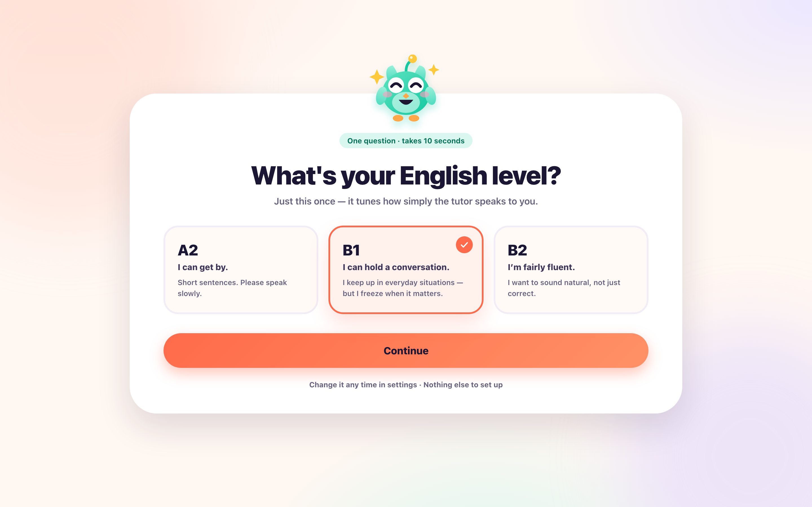
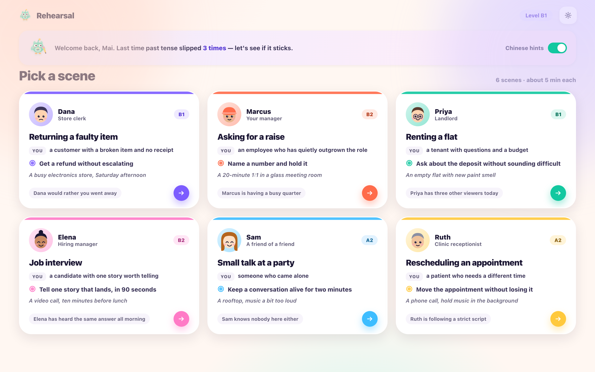
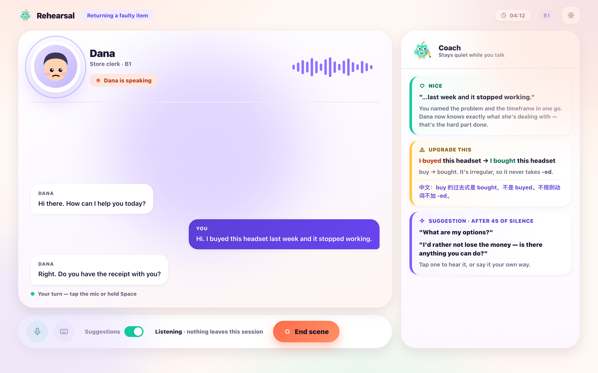
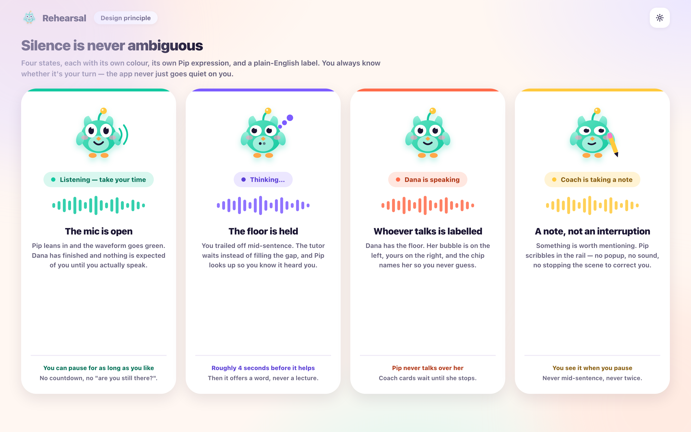
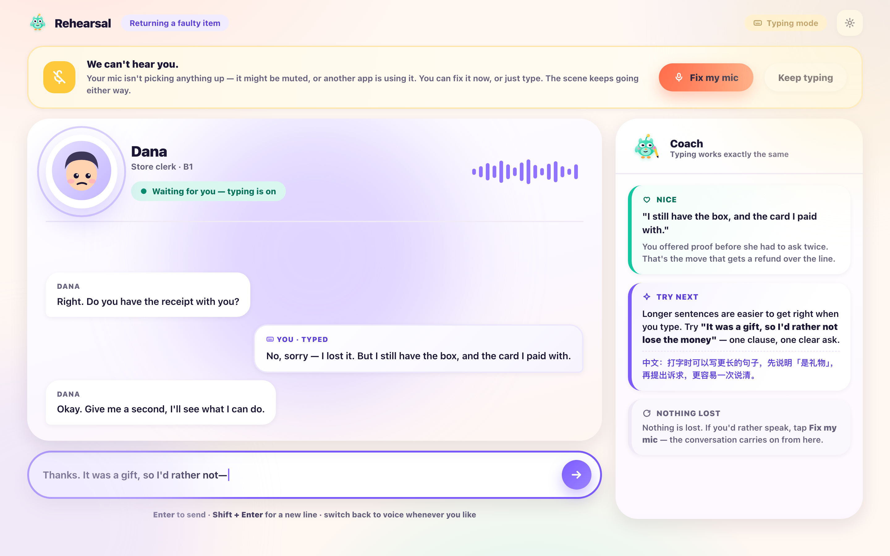
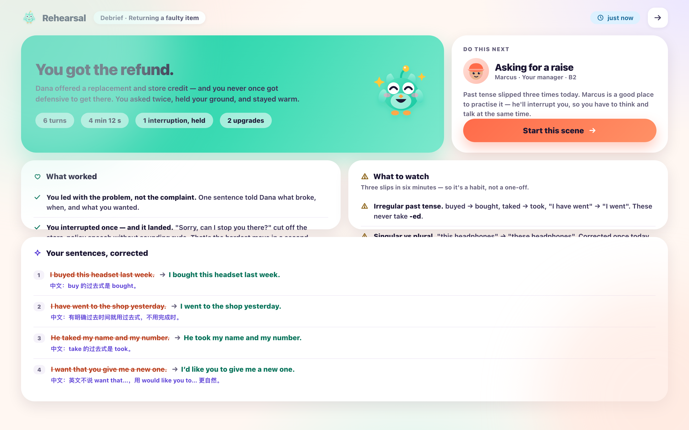
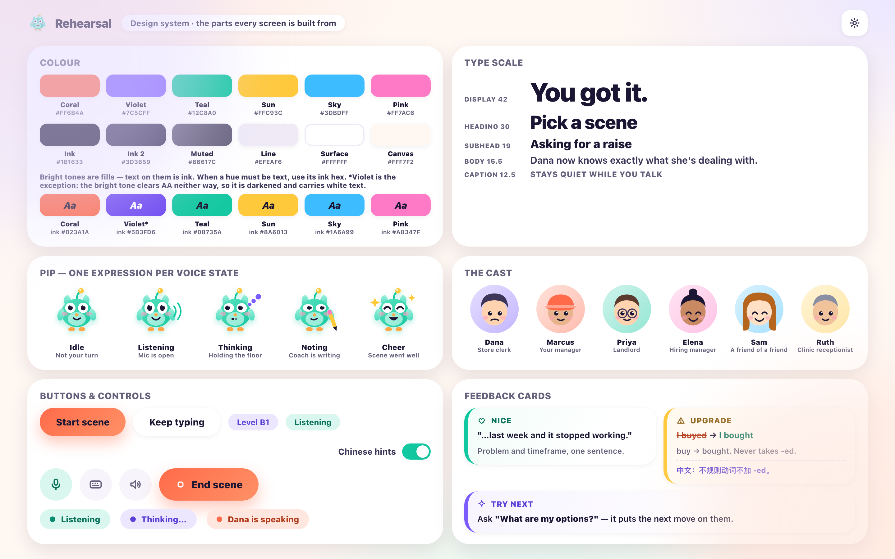

# UI design

Seven screens, one visual language. Every image below is a real render of the
mockup in [`mockups/`](mockups) at 1440×900 (exported at 2×); regenerate with
`./mockups/build.sh`.

The mockups are the source of truth, and `./mockups/build.sh --check` refuses to
build if any screen overflows its viewport, clips text, reuses an SVG `id`, or
contains a text/background pair below WCAG AA. So the screenshots below cannot
drift from the accessibility claims in [§6](#6-accessibility-and-states). See
[`mockups/README.md`](mockups/README.md) for the tooling.

---

## 1. The idea

The learner is nervous — they're here *because* this is hard. So the interface
has one job: **always show what to do next, and never look like a gradebook.**

That rules out the two obvious directions. It can't look like a classroom
(red marks, scores, correction lists) and it can't look like a developer tool
(waveforms, decibels, a big red record button). It should look like a **friendly
game you're playing with someone patient** — which is why the palette is warm
and saturated, the shapes are round, and the coach has a face.

---

## 2. Pip, the virtual tutor

The coach is a small teal bird called **Pip**. He is the product's answer to the
hardest problem in voice UI: *voice has no cursor, so silence is ambiguous.*

Pip **never speaks**. He sits in the coach rail and his expression *is* the
status indicator:

| Mood | When | Face |
|---|---|---|
| `idle` | Not your turn | Neutral eyes, small smile |
| `listen` | Mic is open, waiting for you | Wide eyes, sound-wave arcs |
| `think` | You finished, AI is composing | Eyes glance away, thought bubbles |
| `write` | Coach is recording a correction | Half-closed eyes, pencil |
| `cheer` | Scene went well | Eyes closed in an arc, open smile, sparkles |

Because he's a *character* rather than a status widget, "the coach is watching"
reads as company instead of surveillance — and a learner who never reads a
single feedback card still gets one clear signal from the corner of the screen.

Pip is vector artwork on a fixed grid, so he costs nothing to ship, scales to any
size, and can be animated per-mood later without new artwork.

---

## 3. Visual language

### Colour — vibrant, warm, never alarming

Six saturated brand colours, each with a soft tint used for card fills:

| Token | Hex | Used for |
|---|---|---|
| Coral | `#FF6B4A` | Primary action, "speaking" state |
| Violet | `#7C5CFF` | Coach, suggestions, "thinking" state |
| Teal | `#12C8A0` | Pip, success, "listening" state |
| Sun | `#FFC93C` | Upgrades/notes, warm accents |
| Sky | `#3DBDFF` | Neutral info |
| Pink | `#FF7AC6` | Decorative warmth |

Each hue also has a darker **ink tone** (`--coral-ink #B23A1A`, `--violet-ink
#5B3FD6`, `--teal-ink #08735A`, `--sun-ink #8A6013`, `--sky-ink #1A6A99`,
`--pink-ink #A8347F`) used when the colour has to be *text* rather than a fill —
see [§6](#6-accessibility-and-states).

**Red is absent by design.** A correction is never an error, so there is no
error colour; `warn` cards use Sun (`#FFC93C`) with an amber, not scarlet, text
tone. The one place a red tone appears is inside a strikethrough of the
learner's *old* sentence, next to its green replacement — the pairing does the
work, not the colour alone.

The background is a soft warm canvas with large blurred colour blobs, so no
screen is ever a flat grey page.

### Type

A rounded system stack (`ui-rounded` → SF Pro Rounded → Nunito). Weight carries
hierarchy, not size alone: 900 for headlines, 650–700 for body, 900 small-caps
for captions. Sizes run 42 / 30 / 19 / 15.5 / 12.5 px.

Rounded type matters here for the same reason rounded corners do — it reads as
friendly at a glance, before a single word is processed.

### Shape and depth

Radii are large and consistent: `12 / 20 / 28 / 36 / pill`. Cards float on soft
low-contrast shadows (`rgba(27,22,51,0.06–0.14)`) rather than borders. Nothing
has a hard edge except the divider lines inside cards.

### Motion

One rule: **the waveform and Pip's mood are the only things that move at rest.**
Motion means "the machine is alive and listening", never decoration.

---

## 4. The screens

### 4.1 Onboarding — one question, once

The entire onboarding. Not a form, not a carousel: one question, three cards,
and a "Skip" that defaults sensibly. Pip waves at the top, the cards are big
enough to be a real target, and each level is described in terms of *what you
can do* rather than a test score.

### 4.2 Pick a scene

Each card is a complete briefing in one glance: who you're talking to, who they
are, **your goal**, and one line of setting. The goal is the win condition, so
it gets its own high-contrast band — knowing the goal is what turns talking into
playing.

At the top, the returning-user strip does the memory callback: *"Last time: past
tense, 3 times."* Underneath, a one-line explanation of why the recommended scene
is recommended. The Chinese-hints switch lives here because it's a
once-per-session preference, not a mid-scene control.

### 4.3 Live scene

The core screen, and the one the whole design is built around.

- **Left, the scene.** The character's name, role, and level sit at the top with
  a live waveform. Bubbles are large and generously spaced; the character's
  lines are white, yours are coral-tinted and right-aligned.
- **Right, the coach rail.** Cards land here while you talk. They never overlay
  the scene, never block a bubble, and never interrupt. You can ignore them
  entirely and still finish the scene.
- **Bottom, the controls.** Mic, keyboard (switch to typing), the Suggestions
  switch, a privacy line, and End. Everything reversible is a toggle; nothing is
  a mode you can get stuck in.

**The three feedback card types** — the same three everywhere in the product:

| Card | Colour | Carries |
|---|---|---|
| **Nice** | Teal | Something you did well, quoted |
| **Upgrade** | Sun | Your sentence, the sharper version, why (English + Chinese) |
| **Suggestion** | Violet | Example replies you can tap, opened after 4s of silence |

Upgrades show *your actual words* first — the quote is the anchor, so the card is
useful even if you only read the bold line.

### 4.4 Live states

The same screen in its other three states, with the coach mid-write.

Each state changes **four things at once** — chip colour, chip label, waveform
behaviour, and Pip's face — so it's unmistakable on any one of them. This is
"never ambiguous silence" made concrete: `Listening` (teal) means talk now,
`Thinking` (violet) means wait, `Dana is speaking` (coral) means you can cut in.

### 4.5 Type instead of talk

Reached either from the keyboard control or from the mic-failure alert shown at
the top of this screen.

The alert says what happened in plain language and offers **two** ways forward —
fix it, or carry on typing. Neither is a dead end.

Typing is a **peer mode, not a degraded one**: same transcript, same coach, same
debrief. Your typed bubbles are marked `You · typed` so the debrief can be honest
about which turns were spoken. Longer sentences get easier when you type, and the
coach says so rather than pretending nothing changed.

### 4.6 Debrief

Always produced — after a win, a loss, a rage-quit, or a dropped connection.

- **Did you win?** Answered in the headline, first and largest: *"You got the
  refund."* This is on the never-cut list, so it leads.
- **Next**, top right, with the reason — *"past tense slipped three times today,
  Marcus is a good place to practise it."* The recommendation is justified, not
  asserted.
- **What worked** always has content, quoted from your own turns.
- **What to watch** reports *patterns with counts* — "three slips in six minutes,
  so it's a habit, not a one-off" — which is what makes it feel like coaching
  instead of marking.
- **Your sentences, corrected** is the complete list: your sentence, the better
  version, and a Chinese line. Nothing is hidden and nothing is scored.

There is no percentage, no grade, and no single number anywhere on this screen.

### 4.7 Design system

The parts every screen is built from: palette, type scale, Pip's five moods, the
scene cast, buttons and controls, and the three feedback card types. Useful both
as a build reference and as a check that the language stays consistent.

The palette row is split so the last line *demonstrates* the contrast rule
rather than stating it: `Aa` sits in `--ink` on each bright fill. Violet is
asterisked because its bright tone fails AA both with white and with ink, so that
one fill is darkened and carries white text.

---

## 5. Component inventory

| Component | Variants | Notes |
|---|---|---|
| `bubble` | `them` / `me` / `me.typed` | Typed variant is visually distinct on purpose |
| `fb` card | `nice` / `warn` / `tip` | Left colour bar + tinted head is the only difference |
| `state-chip` | listen / think / speak / note | Dot + label; never colour alone |
| `pill` | tinted, on-canvas | Meta info, never interactive |
| `btn` | primary / ghost | Primary is coral gradient, one per screen |
| `ctrl` | default / active / `end` | Circular icon buttons in the live bar |
| `switch` | on / off | Suggestions, Chinese hints |
| `scene-card` | — | Goal band is the visual anchor |
| `level-card` | selected / unselected | Selection is a ring + tint, not just a border |
| `avatar` | 6 styles × 3 moods | Inline SVG, parameterised by skin/hair/accent |
| `pip` | 5 moods × any size | Inline SVG |

---

## 6. Accessibility and states

- **Never colour alone.** Every state carries a colour *and* a label *and* an
  icon or expression. The feedback card kinds differ by icon and heading text,
  not just tint.
- **Contrast.** Body text is `#3D3659` on white (11.23:1) and muted text is
  `#66617C`, which clears 4.5:1 on all eight surfaces it sits on. The rule that
  matters is that **bright tones are fills, not text** — white on Coral is only
  2.82:1, but `--ink` on Coral is 6.16:1 and on Sun 11.31:1. So buttons, chips
  and banners use dark ink on the bright tone, and a hue used as text on a light
  surface uses its darker `*-ink` tone. Violet is the one exception: its bright
  tone clears AA neither way, so the single violet fill carrying white text is
  darkened to `--violet-deep`.
  The mockup build verifies all of this and fails on any pair below AA.
- **Target size.** Interactive controls are ≥44px; the primary buttons are 52px.
- **Focus.** Round buttons and switches take a visible focus ring; the live
  controls are reachable by keyboard in scene order.
- **Reduced motion.** The waveform falls back to a static bar and Pip to a
  single frame.
- **Text over audio.** Every spoken line is also on screen, so a learner with
  audio off (or a dead mic) can still follow the scene.

---

## 7. What the UI deliberately doesn't do

| Not present | Why |
|---|---|
| Any overall score or grade | Discouraging *and* unreliable — banned by `PRODUCT.md` |
| A pronunciation score | Same, and it's the least actionable number available |
| A big record button | Connecting *is* starting; there's no "press to begin" |
| Waveforms in decibels | Technical, intimidating, and useless to the learner |
| Red error text | A correction is an upgrade, not a mistake |
| A modal that interrupts the scene | Feedback is pull-shaped; it waits to be read |
| An empty state | The character always speaks first |
| A dead end | Every failure path offers a next action |
