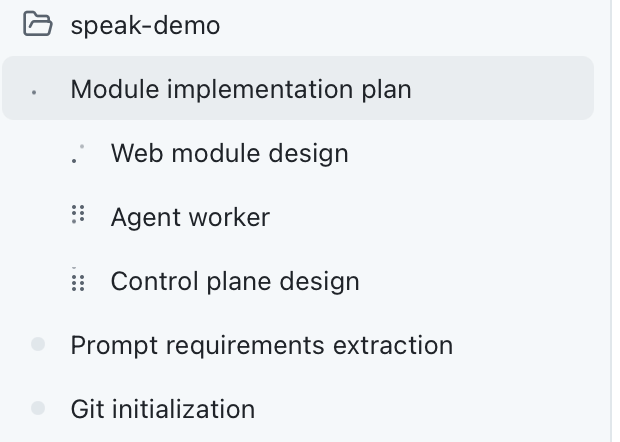

# Development Workflow

## Work Setup
1. AI tool: [Github Copilot](https://github.com/features/copilot)
2. Models: deepseek-flash for product design and quick prototype, gpt-6-astra for coding

## Harness Principles
The work follows these principles:

1. **Specification-driven development:** Write clear specifications before implementation.
2. **Design first:** Define (with AI) the product, user experience, functionality, modules, architecture, and implementation plan before writing code.
3. **Contract first:** Establish strongly typed contracts, interfaces, and APIs using tools such as AJV, Zod, and TypeScript before implementing modules.
4. **Human review gate:** Review all AI-generated documentation and code before committing.

## Stages
### 1. Product Definition
Define what the AI tutor will teach. Keep the scope small and focused, with a clear purpose and target audience.

### 2. Product Design
Use AI-assisted brainstorming to answer the following questions:
1. What is the app building?
2. Who is it for?
3. What is the end-to-end experience?
4. How does the tutor begin a session?
5. How do we prevent user frustration?

Document the results in [docs/PRODUCT.md](docs/PRODUCT.md).

### 3. UI Design
Based on the product design, create the user interface with AI assistance.

Document the results in [docs/design/DESIGN.md](docs/design/DESIGN.md) and [docs/design/UI.md](docs/design/UI.md).

### 4. High-Level Design
Based on the product and UI documentation, define the contracts, APIs, database, functions, and module boundaries.

The application is composed of three modules:

1. **Web:** The frontend module responsible for presenting the user interface.
2. **Control plane:** Handles session setup, durable coordination, authorization, recovery, and finalization asynchronously or through Redis-backed state. Its durable SQLite persistence uses Drizzle ORM with relational tables and typed transactions.
3. **Agent worker:** Owns the real-time conversation path. Per-turn audio processing, transcription, generation, interruption handling, and event publication must not synchronously depend on the control plane.

Document the results in [CODE_INSTRUCTION.md](docs/CODE_INSTRUCTION.md), [DATABASE.md](docs/DATABASE.md) and [ARCHITECTURE.md](docs/ARCHITECTURE.md).  

### 5. Contract and API Implementation
Create a contracts package that defines the interfaces between the web, control-plane, and agent-worker modules.

Produce `packages/contracts` and the relevant `courses/*` materials.

### 6. Parallel Module Implementation
Delegate the implementation to three sub-agents, each working in an isolated worktree. Implement the web, control-plane, and agent-worker modules in parallel while recursively following the **specification-driven, design-first, and human-gate** principles.

Produce [web.md](docs/modules/web.md), [agent-worker](docs/modules/agent-worker.md), [control-plane](docs/modules/control-plane.md) and the corresponding `apps/*` implementations.

### 7. Integration and Validation
Merge the three worktrees, verify the integrated features end to end, and run the full relevant test suite.

### 8. User Experience Refinement
Evaluate the product as an end user and improve the UI layout, interactions, and overall flow.

### 9. Dockerization
Create the Docker Compose configuration and update [README.md](README.md) with setup and usage instructions.